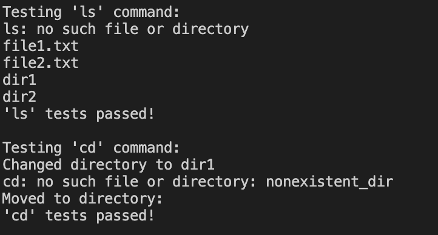

# Shell Emulator

### Описание

**Shell Emulator** – это эмулятор командной строки UNIX-подобной операционной системы с графическим интерфейсом. Эмулятор работает с виртуальной файловой системой, основанной на ZIP-архиве, и поддерживает выполнение основных команд, таких как `ls`, `cd`, `exit`, а также дополнительные команды для работы с датой и временем, календарем и содержимым файлов.

Эмулятор имитирует взаимодействие с оболочкой (shell) и позволяет работать с виртуальной файловой системой через удобный графический интерфейс.

---

### Возможности

Поддерживаемые команды:

- `ls` – отображение содержимого текущей директории.
- `cd` – переход между директориями.
- `exit` – завершение работы эмулятора.
- `cal` – вывод календаря на текущий месяц.
- `tac` – вывод содержимого файла в обратном порядке.
- `date` – отображение текущей даты и времени.

---

### Запуск эмулятора

Для запуска эмулятора выполните:

1. Удалите виртуальное окружение и создайте свое в соотвествии с операционной системой.

На MacOS:
```bash
python3 -m venv venv
```

На Windows:
```bash
python -m venv venv
```

2. Запустите виртуальное окружение.

На MacOS:
```bash
source venv/bin/activate
```

На Windows:
```bash
venv\Scripts\Activate.bat
```

3. Установите зависимости

```bash
pip install -r requirements.txt
```


**Запуск в свободном режиме**
```bash
python shell_emulator.py --username your_username --vfs path_to_zip_file --script path_to_startup_script (optional)

```

**Тестирование**  
Для запуска тестов выполните:
```bash
python test_shell_emulator.py
```

Каждый тест создаёт виртуальный ZIP-архив, использует его для проверки корректности команд (ls, cd, tac) и удаляет его после завершения.
Структура проекта
shell_emulator.py – основной файл, реализующий GUI и команды эмулятора.
test_shell_emulator.py – файл с тестами для всех поддерживаемых команд.
requirements.txt – зависимости для установки.
Пример работы
Запуск команд

```plaintext
user@localhost:/dir1$ ls
dir12
text1.txt
user@localhost:/dir1$ cd dir12
Changed directory to dir1/dir12
user@localhost:/dir1/dir12$ ls
text2.txt
```
